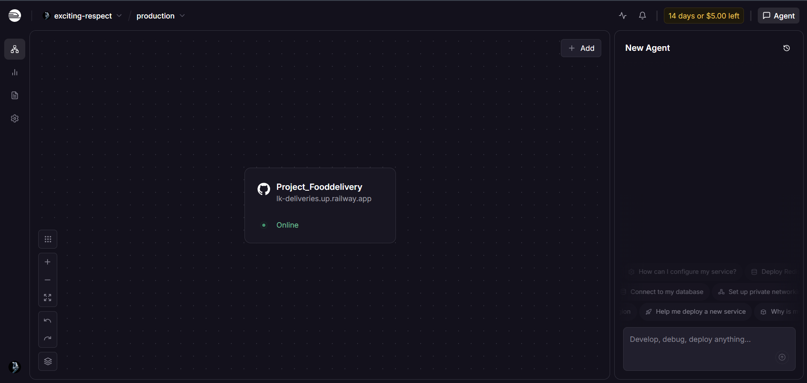
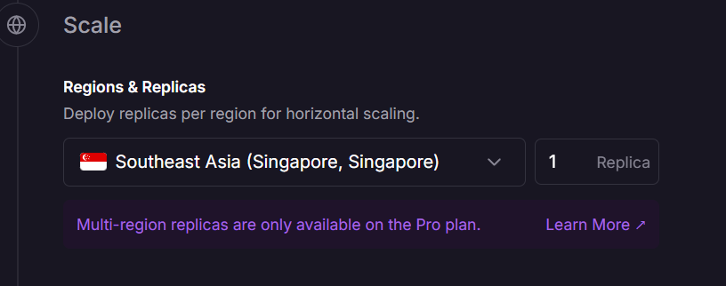
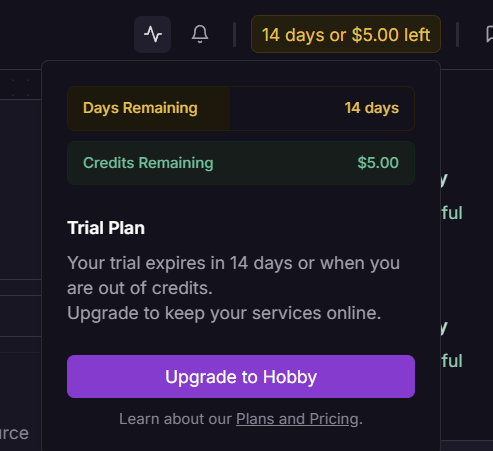
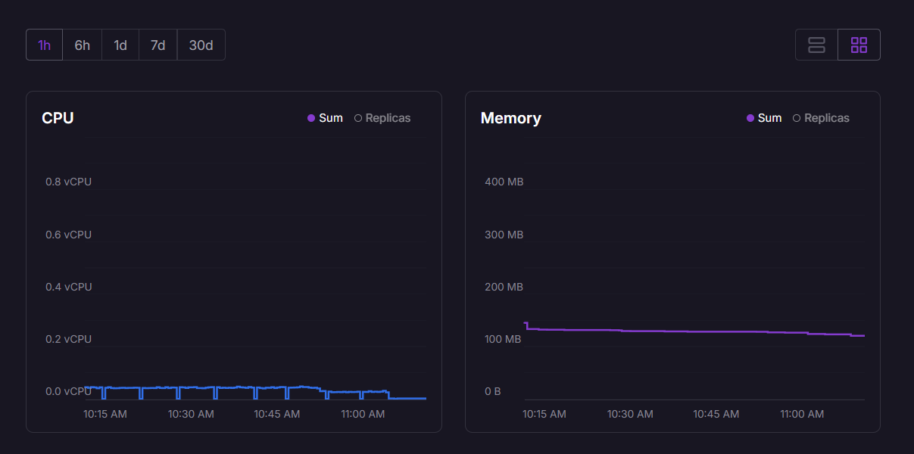

# LK Deliveries Cost Estimate Report

## Project Summary

LK Deliveries is a Python Flet application deployed on Railway. We kept the deployment simple so the monthly cost stays low and the project is realistic for a student submission.

## Railway Screenshots

**Dashboard**

**Server**

**Credits and Plan**

**Usage**

These screenshots show our Railway Trial Plan with $5.00 credits, the LK Deliveries service active and running, and minimal resource usage.

## Cost Breakdown Table

| Item | Service | Estimated Monthly Cost | Notes |
| --- | --- | ---: | --- |
| App hosting | Railway | $0 - $5 | Small project, so the free or low-cost tier is enough |
| Database | SQLite | $0 | Stored in the app container, so no separate database bill |
| Image storage | Cloudinary | $0 | Free tier works for a class project |
| Email notifications | SMTP / Gmail | $0 | Uses an existing email account or free SMTP setup |
| Customer login | Google OAuth | $0 | OAuth login itself does not cost anything |
| Domain name | Railway default domain | $0 | No custom domain needed for this project |

## Cost Estimate Summary

**Estimated monthly total:** $0 - $5

This estimate assumes the project stays small, uses SQLite instead of a managed database, and relies on free-tier services where possible.

## Cost Optimization Strategy

1. Use SQLite instead of a paid database.
2. Avoid custom domains unless they are actually needed.
3. Keep image storage and email on free tiers.
4. Run only one Railway service for the app.
5. Avoid extra workers or containers that would raise the cost.

## Justification

The app is designed as a class project, so the main goal is to show cloud deployment, documentation, and working features without making the bill bigger than it needs to be. Railway fits that goal because it is simple and cheap to run.

## Optional Comparison

| Platform | Estimated Cost | Notes |
| --- | ---: | --- |
| Railway | $0 - $5 | Simple and inexpensive for a small app |
| Azure | Higher / variable | More setup and usually more expensive for a student project |
| AWS | Higher / variable | More complex pricing and setup |

## Conclusion

LK Deliveries can be deployed at very low cost by using Railway, SQLite, and free-tier services. That makes it practical for a student demo while still showing a complete cloud workflow.
